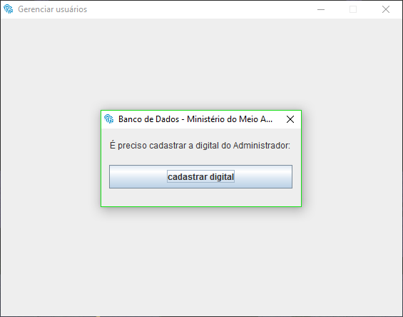
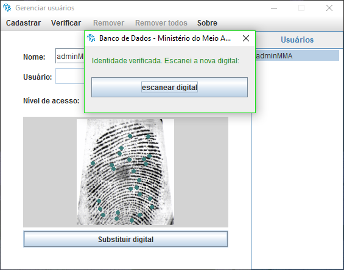
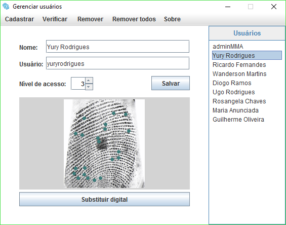
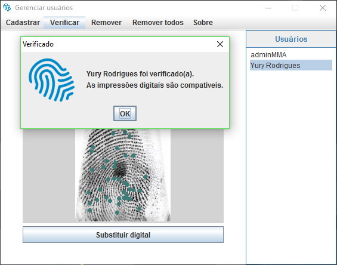
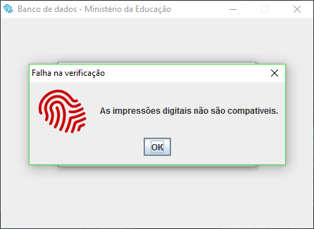

# MMA-Biometria
Sistema de identificação e autenticação biométrica com interface gráfica, para restringir o acesso dos usuários a um determinado banco de dados. Esta restrição deve ser feita levando-se em consideração os níveis de permissão de acesso que os usuários têm há determinadas informações, que serão divididas em 3 níveis.

Este projeto foi desenvolvido durante a graduação em Ciência da Computação na UNIP.

O arquivo [APS - Biometria.pdf](https://github.com/yuryrodrigues/MMA-Biometria/blob/master/APS%20-%20Biometria.pdf) contém a dissertação sobre a biométria e o projeto deste sistema, incluindo a descrição da estrutura do sistema e as ferramentas utilizadas.

Imagens dos programas
-------------------

#### Programa que gerencia os usuarios ####

### Programa que acessa o banco de dados do sistema ###

